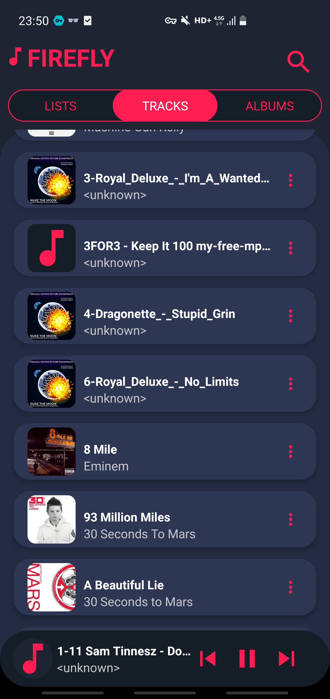
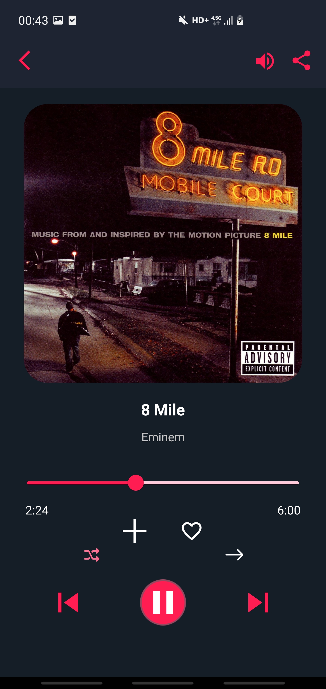
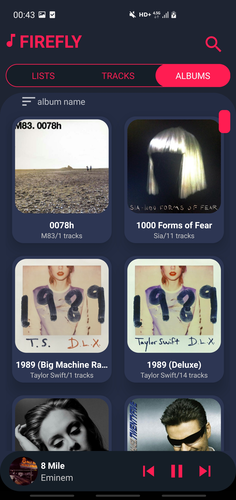
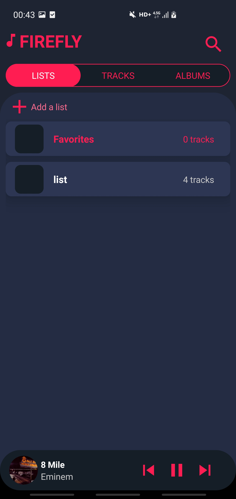
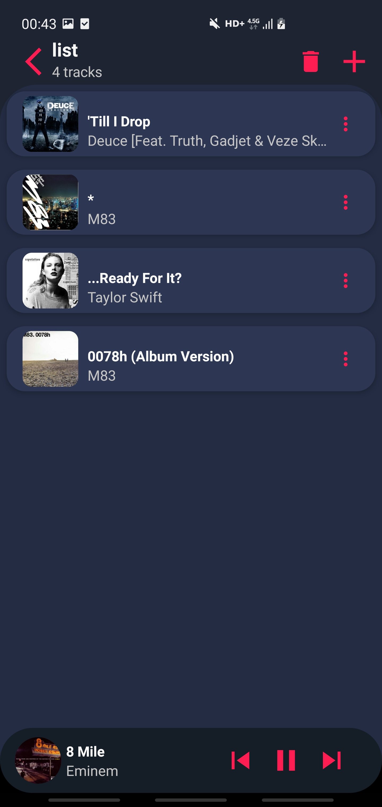
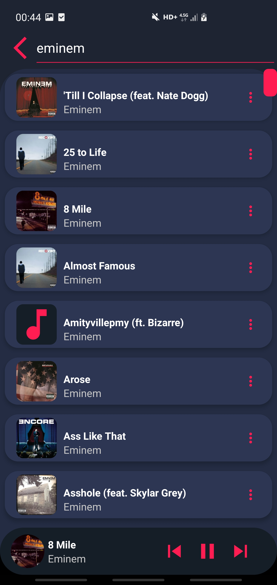
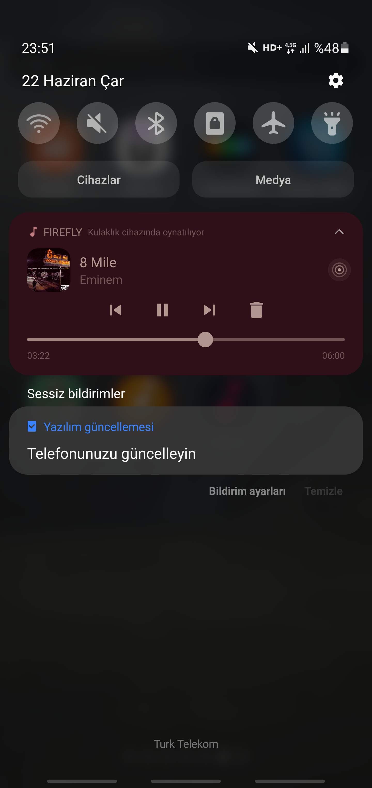
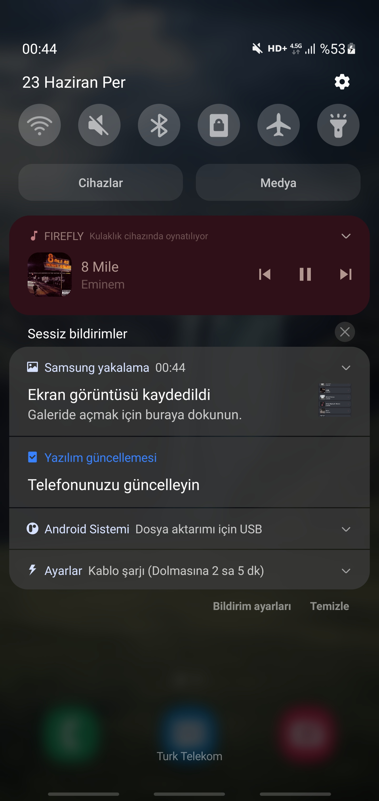

# Firefly Android Music Player

A fully functional Android music player application with background playback, media session controls, and a responsive user interface.

---

## Overview

Firefly is a local music player designed to provide a smooth and reliable listening experience. It supports background playback, system-level media controls, and efficient music library management.

---

## Features

- Background playback (works with screen off)  
- Media-style notification with album art and playback controls  
- Search songs and browse albums  
- Favorites system  
- Custom playlists (create, update, delete)  
- Shuffle and repeat modes  
- Responsive UI with animations  
- Song sharing support  

---

## Technical Highlights

- Implemented MediaSession API for system-level playback control  
- Managed background services for uninterrupted audio playback  
- Handled Android lifecycle events for stable media behavior  
- Designed responsive UI with efficient state management  

---

## App Capabilities

- Play audio in background and lock screen  
- Control playback via notification panel  
- Organize music with playlists and favorites  
- Navigate music library efficiently  

---

## Tech Stack

- Java / Kotlin  
- Android SDK  
- MediaSession API  
- RecyclerView and standard UI components  

##### ScreenShots
      
       

