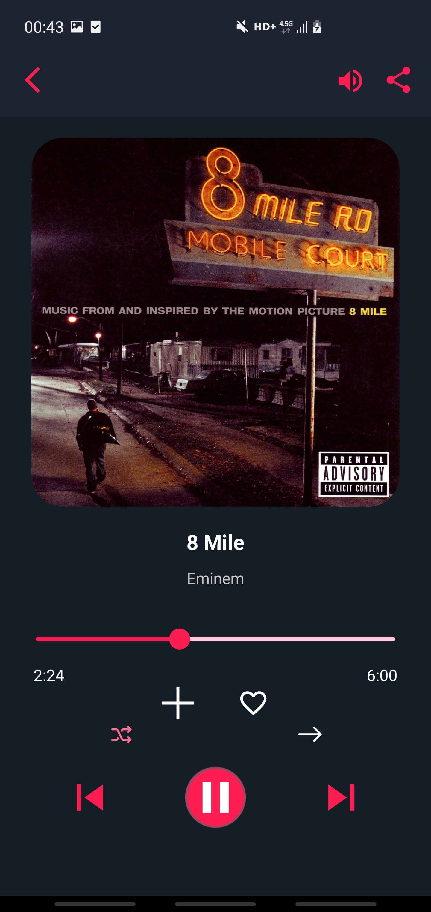
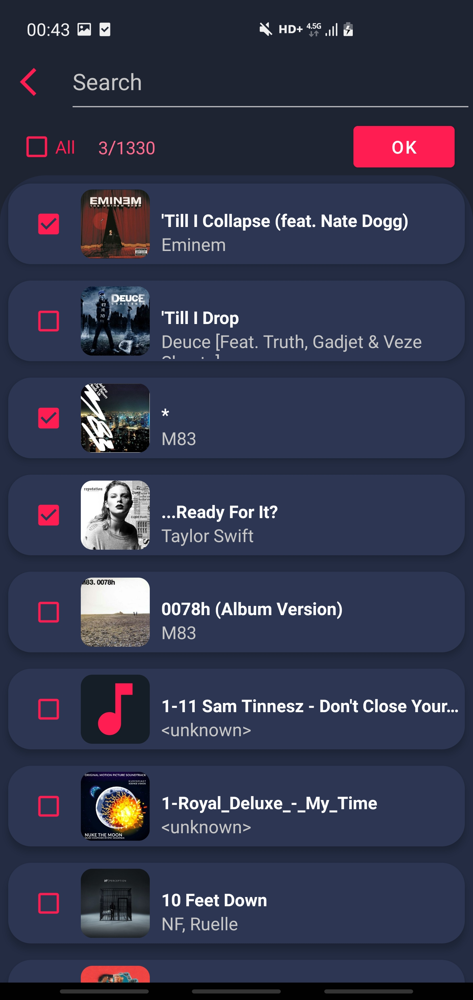

##Firefly Android Music Player
### Features

- play songs even in background and off-screen;
- media style notification with album art and controls;
- share your songs;
- search songs;
- view albums;
- album arts;
- favorites;
- add ,update and delete custom track lists;
- responsive screen with animations;
- shuffle or repeat lists;
- switch between lists;

##### ScreenShots
      
       

